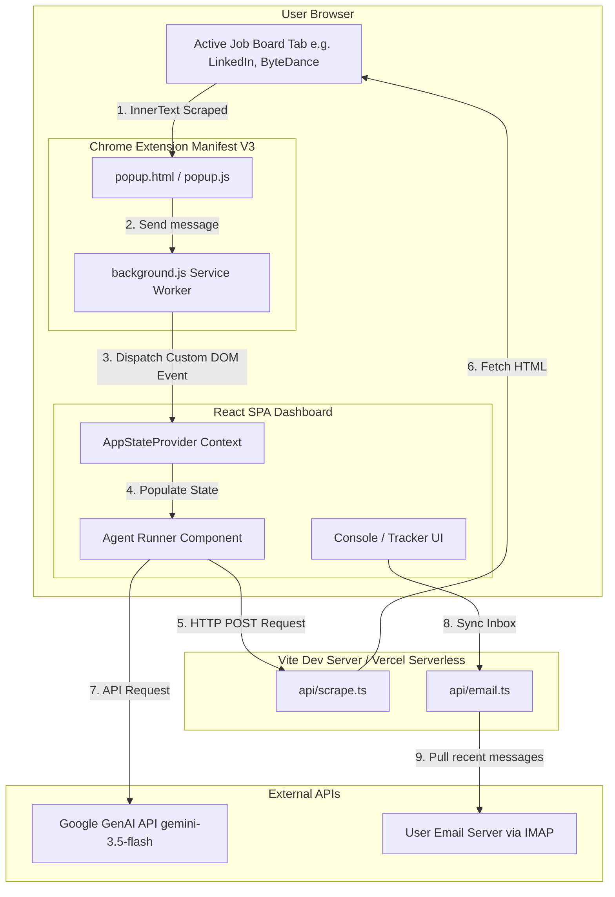

# TalentFlow — Technical Interview Cheat Sheet & Project Guide

This guide is structured to help you confidently explain the architecture, code implementation, and key engineering decisions of **TalentFlow** during technical interviews.

---

## 1. The Elevator Pitch (How to introduce the project)
> *"TalentFlow is an agentic, AI-driven career suite designed to automate the job application lifecycle. It consists of a React SPA dashboard, a Node.js backend proxy, and a Manifest V3 Chrome Extension. Users can scrape job descriptions directly from job boards, parse them against their candidate profile using Gemini, and instantly generate tailored resume profiles, custom cover letters, and mock interview prep kits. It also features a server-side IMAP scanner that automatically parses inbox emails to update application statuses."*

---

## 2. System Architecture
Here is how the components communicate:



---

## 3. Core Features & Code Walkthrough

### A. The Chrome Extension Scraper (Bypassing Anti-Bot Walls)
* **Goal**: Scrape job descriptions directly from pages like LinkedIn or Glassdoor.
* **How it works**:
  1. In [extension/popup.js](file:///Users/sasi/antigravity/Talentflow/extension/popup.js#L48), when the popup opens, it queries the active tab and executes a script to retrieve the text content of the DOM:
     ```javascript
     const scriptResult = await chrome.scripting.executeScript({
       target: { tabId: tab.id },
       func: () => document.body.innerText
     });
     scrapedText = scriptResult?.[0]?.result || '';
     ```
  2. In [extension/background.js](file:///Users/sasi/antigravity/Talentflow/extension/background.js#L47), it identifies if a TalentFlow dashboard tab is open. If found, it brings it to focus and dispatches a Custom DOM Event to the main frame context (`world: 'MAIN'`):
     ```javascript
     await chrome.scripting.executeScript({
       target: { tabId },
       world: 'MAIN',
       func: (u, j, a) => {
         window.dispatchEvent(new CustomEvent('AUTOJOB_EXTENSION_SEND', {
           detail: { url: u, jdText: j, autoRun: a }
         }));
       },
       args: [url, jdText, autoRun]
     });
     ```
  3. In the React app ([src/state.tsx](file:///Users/sasi/antigravity/Talentflow/src/state.tsx#L165)), a global listener captures this event, redirects the user's view to the Agent Runner, and pre-fills the data.

### B. The Serverless Scraper API
* **Goal**: Fallback scraping when the extension isn't used.
* **How it works**:
  1. The agent makes an API call to `/api/scrape?url=...` (defined in [api/scrape.ts](file:///Users/sasi/antigravity/Talentflow/api/scrape.ts)).
  2. The handler fetches the page using a generic User-Agent to mimic a browser, retrieves the raw HTML text, and runs regular expressions to strip scripts, styles, and tags:
     ```typescript
     const text = html
       .replace(/<script[^>]*>([\s\S]*?)<\/script>/gi, '')
       .replace(/<style[^>]*>([\s\S]*?)<\/style>/gi, '')
       .replace(/<[^>]+>/g, ' ')
       .replace(/\s+/g, ' ')
       .trim();
     ```

### C. The Agent Runner AI Pipeline
* **Goal**: Execute a multi-step orchestration pipeline (Scrape &rarr; LLM Parse &rarr; Resumé & Cover Letter Tailoring &rarr; Save).
* **How it works**:
  1. The pipeline is orchestrated in [src/components/AgentRunner.tsx](file:///Users/sasi/antigravity/Talentflow/src/components/AgentRunner.tsx#L160).
  2. The scraped text and user profile are bundled and sent to Gemini via the **Google GenAI SDK** (`@google/genai` library).
  3. The prompt explicitly defines the JSON output schema. The response is validated, cleaned of code block markers using a custom character parsing algorithm (`cleanJSONString`), and saved to local state.

### D. Email Scanner (IMAP Status Tracker)
* **Goal**: Auto-update application status (e.g., transition a job from `applied` to `interview`) by monitoring incoming emails.
* **How it works**:
  1. In [api/email.ts](file:///Users/sasi/antigravity/Talentflow/api/email.ts), a connection is established using `imapflow` to query the user's inbox (e.g., Gmail IMAP server).
  2. The serverless function streams the last 15 emails, parsing the raw mail objects with `mailparser` (`simpleParser`).
  3. It filters for messages containing keywords like *interview, offer, rejection, applied*.
  4. It sends these email snippets to Gemini which matches them against existing tracked applications, extracts company/roles, classifies the email status, and returns a sync recommendation.

---

## 4. Key Engineering Decisions & Technical Trade-offs

### 1. Browser-level vs. Server-side scraping (Solving Anti-Bot Protections)
* **Challenge**: Standard server-side HTTP `fetch()` requests targeting high-security corporate portals (like `jobs.bytedance.com` or `careers.google.com`) are immediately blocked by firewalls (Akamai, Cloudflare) or raise `fetch failed` exceptions due to datacenter IP blacklisting.
* **Solution**: You developed the Chrome Extension Manifest V3 as the primary entry point. Because the extension runs in the user's active browser, it naturally rides on a residential IP address with local cookies and headers already validated. The extension fetches `document.body.innerText` directly, bypassing Cloudflare/Akamai walls completely.

### 2. State Preservation and Context Preservation (Lifting State Up)
* **Challenge**: Originally, navigating away from the Agent Runner to view the Dashboard or settings unmounted the runner component, wiping out the active URL inputs, text fields, and running agent logs.
* **Solution**: You lifted the state out of local React hooks (`useState`) and integrated a unified `RunnerState` into the global `AppStateProvider` context ([src/state.tsx](file:///Users/sasi/antigravity/Talentflow/src/state.tsx#L136)). You proxied the component's state setters to update this context. As a result, the agent's asynchronous execution runs in the background even when the view is unmounted, and the user's inputs are preserved when they return.

### 3. ephemerality of Service Workers (Manifest V3)
* **Challenge**: In Chrome Extension Manifest V3, background service workers are ephemeral and shut down after ~30 seconds of inactivity, which can destroy in-memory variables.
* **Solution**: The communication between the popup and the app is handled transiently via message passing (`chrome.runtime.sendMessage`). Since the background script does not need to store state (it only acts as an event handler that focuses the React tab and dispatches the CustomEvent), it conforms to Manifest V3’s stateless architecture.

---

## 5. Potential Interview Questions & Answers

#### Q1: Why did you use Gemini over other LLMs?
> *"I used the new Google GenAI SDK (`@google/genai`) to integrate `gemini-3.5-flash`. The choice was driven by two factors: low latency (which is crucial for an interactive agent dashboard) and a large context window. Since job descriptions and full user resumes combined can exceed thousands of tokens, Gemini is well-suited to process the full payload efficiently without truncation. Additionally, Gemini's native support for JSON schema responses ensures that data matches the front-end TypeScript interfaces perfectly."*

#### Q2: How do you handle LLM JSON parsing errors?
> *"LLMs sometimes wrap JSON in markdown block markers (like ` ```json ... ``` `) or include leading/trailing conversational text. I created a robust `cleanJSONString` helper in the library layer. It locates the first opening brace (`{` or `[`) and uses a balanced-brace counting scan to strip out any invalid surrounding characters before calling `JSON.parse()`. This guarantees the application doesn't crash on slightly malformed responses."*

#### Q3: What is the benefit of the IMAP email sync and how did you secure credentials?
> *"The IMAP sync automates the status tracking loop, so users don't have to manually update their kanban board when they get an invite. For security, credentials can be populated via environment variables on the backend, or typed locally. Since the proxy connects to the user's IMAP server over an encrypted TLS connection (port 993) and parses details on-the-fly without database persistence, credentials and email data never leak or persist in database storage."*

#### Q4: If you had more time, how would you scale this?
> *"First, I would add database persistence (e.g. Supabase or Cloud Firestore) with OAuth authentication to replace localStorage. Second, I would expand the Chrome Extension to run content scripts on job applications pages to enable in-page overlay UI elements (like showing the matching score directly on a LinkedIn job board page)."*
